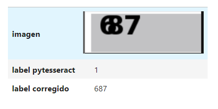

# Custom OCR model para descifrar captchas

## 1. Descripción
El objetivo de este proyecto es entrenar un modelo utilizando algoritmos de Visión Computacional, para leer captchas e identificar de manera precisa la información que contiene, para luego utilizarlo en un proceso de webscraping posterior.

## 2. Metodología.
### 2.1. Base de datos.
Para construir la base de datos se siguieron los siguientes pasos:
- Desarrollo de un proceso de web scraping, el cual en resumen hacía lo siguiente:
    - Conectarse a la web de la cual se recuperó la información.
    - Tomar un screen shot de la pagina web.
    - Ubicar el area donde se encotraba el cptcha y recortarla.
    - Guardarlo la imagen del captcha en una carpeta local.
    - Actualizar la página para seguir entrayendo más imágenes.
- Etiquetar las imágenes de los captchas extraídao. Este proceso incluye:
    - Cargar las imágenes.
    - Extraer el texto de las imágenes utilizando la librería ``pytesseract``.
    - Guardar en una base de datos el id de la imagen y el texto extraído.
    - Revisar manualmente las etiquetas obtenidas con ``pytesseract`` y corregirlas en caso de ser necesario.

Finalmente se logró armar una base de datos de 1,000 imágenes con sus respectivas etiquetas, en la siguiente imagen se muestra en resumen lo desarrollado en esta etapa.

### 2.2. Experimentación.
### 2.3. Resultados.

